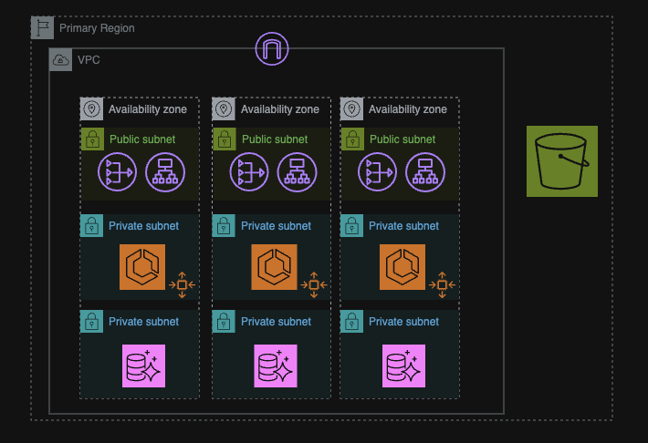
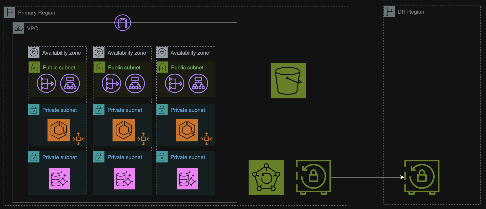

# Sonar - Highly Available AWS Infrastructure with Disaster Recovery

A Terraform project that deploys a highly available infrastructure with disaster recovery capabilities on AWS.

## Architecture Overview

This project implements a highly available architecture with the following components:

- VPC with public and private subnets across multiple availability zones
- Aurora database with automated backups for same-region disaster recovery
- ECS clusters for containerized applications
- Application Load Balancer for traffic distribution




- Optional cross-region disaster recovery using AWS Backup



## Project Structure

```
terraform-project/
├── environments/
│   ├── dev/       # Development environment configuration
│   └── prod/      # Production environment configuration
├── modules/
│   ├── alb/       # Application Load Balancer module
│   ├── aurora/    # Aurora database module
│   ├── dr/        # Disaster Recovery module
│   ├── ecs-cluster/ # ECS Cluster module
│   ├── ecs-service/ # ECS Service module
│   ├── s3/        # S3 bucket module
│   └── vpc/       # VPC network module
└── README.md
...
```

## Prerequisites

- [Terraform](https://www.terraform.io/downloads.html) (v1.0.0+)
- AWS CLI configured with appropriate credentials
- Basic knowledge of AWS services and Terraform

## Deployment Instructions

```bash
cd environments/<your-enviroment>/
terraform init
terraform apply
```
In case of a disaster, you can redeploy the infrastructure from scratch and recover the sensitive data stored in Aurora using the service’s automated backups.
**Note**: This proof of concept assumes that the only critical data is stored in the database; all other data and resources are considered stateless.

### Enabling Cross-Region Disaster Recovery

If you require cross-region DR protection, you can enable cross-region disaster recovery:

```bash
cd environments/<your-enviroment>/
terraform init
terraform apply -var="enable_dr=true" -auto-approve
```

This configures AWS Backup to create daily backups of the Aurora database. In the event of a regional disaster, you can deploy the solution in the DR region and restore the Aurora database from the backup.
Note: As with the main deployment, this assumes the database is the only critical component, and all other services are stateless.

## Clean Up

To destroy the infrastructure:

```bash
cd environments/<your-enviroment>/
terraform destroy
```

## Contributing

Contributions are welcome! Please feel free to submit a Pull Request.

## License

This project is licensed under the MIT License - see the LICENSE file for details.